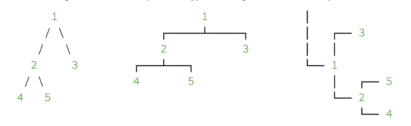
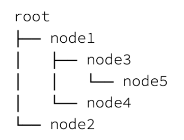
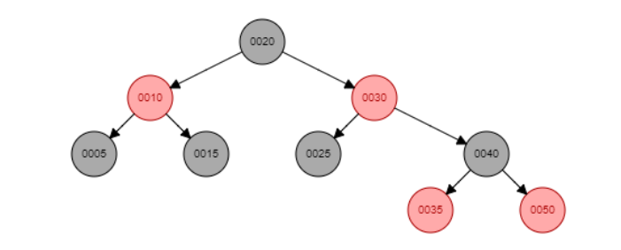

[](https://classroom.github.com/online_ide?assignment_repo_id=9502170&assignment_repo_type=AssignmentRepo)
#  Understanding and Implementing Different Data Structures


## 1. Doubly Linked List

Implement the class `DoublyLinkedList` as defined by the following skeleton. Each `Node` of the linked list should be able to hold an integer value. After executing every selected operation, the program should print the updated linked list to the console.

```cpp

class DoublyLinkedList{
private:  
  Node* start;
public:
  void insertBeg(int X);  //Insert a new node at the beginning (Operation 1)
  void insertEnd(); 	  //Insert a node at the end (Operation 2)
  void deleteBeg(); 	  //Delete a node from the beginning (Operation 3)
  void deleteEnd();	  //Delete a node from the end (Operation 4)
  void delete(int D);	  //Delete a node with a given value (Operation 5)
  void print();		  //Print current list (Operation 6)
  Node* search(int F);	  //Search an existing element (Operation 7)
  int sum();		  //Add list values to get sum (Operation 8)
};

```

Above code snippest is given in the [DoublyLinkedList.h](https://github.com/CO-FOE-USJ/CO-FOE-USJ-CO2201_Data_Structures_Practical/blob/c9272fdea04ac844803a8170db96590d70a8e994/DoublyLinkedList.h) file.

### Task 1
- [ ] Complete the [Node.h](Node.h) class to hold an integer value and two links to left and right.
- [ ] Complete the [DoublyLinkedList.cpp](DoublyLinkedList.cpp) file with the implementation of all the functions.
- [ ] Complete the [Q1_main.cpp](Q1_main.cpp) file to test the implemented Doubly Linked List.

Your implementation of the main function should take user inputs in the following format.

```
5           // number of elements to insert  
4 8 10 2 7  // elements to insert  
2           // number of operations 
1 5         // operation_number  input_data
4           // operation_number
```
First three lines should be mandatory and remaining lines depend on the number of operations user has defined.  
Operation numbers are as follows:

1 - Insert Beginning  
2 - Insert End  
3 – Delete Beginning  
4 – Delete End  
5 – Delete Value  
6 – Print  
7 – Search  
8 – Sum  
0 - Exit  

Please note that some operations do not take input data.  
It should output the updated linked-list after each operation. Output for the above example input should be as follows:

```
4 8 10 2 7      //after initial insertion
5 4 8 10 2 7    //after operation 1
5 4 8 10 2      //after operation 2
```

## 2. Finding Common elements

Develop a function that takes two doubly linked lists as constant arguments and returns a new doubly linked list that contains every number the two lists have in common. One or both of the input lists may be empty or contain numbers. Output array should be **sorted**.

First, check whether each list has duplicate values. If any of the input lists contain a duplicate value, print an error message `Duplicate Found` and return. For example, list `3, 5, 6, 7, 3` which has 2 copies of 3, is not allowed. 

### Task 2
- [ ] Complete the [Q2_main.cpp](Q2_main.cpp) file with the implementation of the above function. Use the `DoubleLinkedList` class implemented in Quesion 1.

Two example inputs and respective outputs are given below.

Input 1:
```
8                   // Size of the first list
3 2 4 9 8 1 10 5    // Firt list
7                   // Size of the second list
10 1 7 6 4 5 9      // Second list
```

Output 1:
```
1 4 5 9 10
```

Input 2:
```
4
1 2 3 4
4
1 2 3 1
```

Output 2:
```
Duplicate Found
```

## 3. Binary Search Tree

Implement the class `BinarySearchTree` using the `Node.h` implemented in Question 01. Include the following operations as functions to the `BinarySearchTree` class. Use appropriate names for the functions.

 1. Insert a new value into the tree
 2. Delete a given value from the tree (use in-order successor for replacement)
 3. Print the values in the tree in Pre-order
 4. Print the values in the tree in In-order
 5. Print the values in the tree in Post-order
 6. Search a given value in the tree
 7. Count the number of nodes in the current tree
 8. Get the height of the tree
 9. Find the smallest value in the tree
 10. Find the largest value in the tree
 11. Delete the entire tree
 12. Print tree

Updated tree should be printed to the console after each of the following operations.
 1. Insert a new value into the tree
 2. Delete a given value from the tree

#### Printing a Tree to Console

Despite the limitations of drawing with only characters on the console, there are many different diagram shapes to represent tree structures. Choosing one of them mostly depends on the size and balance of the tree.

The following are some of the possible types of diagrams that we can print:



However, the following one is the most practical one that is also easier to implement. We can call it a horizontal considering the direction in which it grows:



In this representation, three special characters (```│, ├──,``` and ```└──```) along with appropriate number of spaces are used to represent the tree.
An example BST and its representation on a console is shown below.

#### BST Tree



#### Console Representation
```
20
├──30
│  ├──40
│  │  ├──50
│  │  |  ├──X
│  │  |  └──X
│  │  └──35
│  │     ├──X
│  │     └──X
│  └──25
│     ├──X
│     └──X
└──10
   ├──15
   |  ├──X
   |  └──X
   └──5
      ├──X
      └──X
```

Implement the `printTree()` function to print BST on the console according to the above given format. Use exactly the same characters for the implementation. Follow [this link](https://www.baeldung.com/java-print-binary-tree-diagram) for more information.

### Task 3
- [ ] Complete the [BinarySearchTree.h](BinarySearchTree.h) class.
- [ ] Complete the [BinarySearchTree.cpp](BinarySearchTree.cpp) file with the implementation of all the functions.
- [ ] Implement the `printTree()` function in the `BinarySearchTree` class according to the given instructions.
- [ ] Complete the [Q3_main.cpp](Q3_main.cpp) file to test the functionalities of the `BinarySearchTree` class.

Example input and THE respective output is given below. Use the given number (see above) to indicate each operation.

Input:
```
8                 // Number of nodes in the initial tree
8 4 10 6 9 2 12 5 // Values of the nodes
4                 // Number of operations to follow
1 7               // Operation_number input (insert 7 to BST)
2 6               // Operation_number input (delete 6 from the BST)
7                 // Operation_number (count of the nodes)
10                // Operation_number (find the largest value)
```

Output:
```
8
├──10
│  ├──12
│  |  ├──X
│  |  └──X
│  └──9
│     ├──X
│     └──X
└──4
   ├──6
   |  ├──X
   |  └──5
   │     ├──X
   │     └──X
   └──2
      ├──X
      └──X
      
8
├──10
│  ├──12
│  |  ├──X
│  |  └──X
│  └──9
│     ├──X
│     └──X
└──4
   ├──6
   |  ├──7
   │  |  ├──X
   │  |  └──X
   |  └──5
   │     ├──X
   │     └──X
   └──2
      ├──X
      └──X
      
8
├──10
│  ├──12
│  |  ├──X
│  |  └──X
│  └──9
│     ├──X
│     └──X
└──4
   ├──7
   |  ├──X
   |  └──5
   │     ├──X
   │     └──X
   └──2
      ├──X
      └──X

8

12
```


